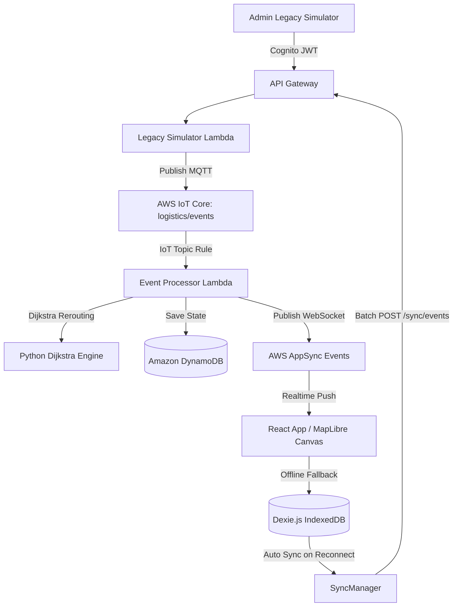

# Logistics Control Tower (Smart Delivery & Delay Tracker)

> **Use Case ID**: 2026 GH-CT-02  
> **Problem Statement**: Packages moving through multi-city networks often face sudden delays from traffic, weather, or hub congestion. Logistics managers lack an easy way to catch these delays early, recalculate new transit routes in real time, and keep operations running smoothly when internet connections drop.

---

## 📌 Project Purpose

The **Logistics Control Tower** is a real-time tracking, delay management, and route recalculation platform built as a hackathon MVP. It empowers supply chain managers to monitor package movements across a multi-hub transportation network, catch delivery risk factors early, recalculate fastest alternative paths deterministically, and maintain operational resilience during connectivity loss.

---

## 🏆 MVP PASS/FAIL Checklist (Phase 6 Final Validation)

| Requirement Category | Specific Capability | Status |
| :--- | :--- | :---: |
| **Requirement 1** | **Live package locations** | **PASS** |
| | **At-risk shipments** | **PASS** |
| **Requirement 2** | **Delay detection** | **PASS** |
| | **Alternative route** (Dijkstra algorithm) | **PASS** |
| **Requirement 3** | **Offline storage** (Dexie.js / IndexedDB) | **PASS** |
| | **Automatic sync** (Idempotency & batch POST) | **PASS** |
| **Requirement 4** | **Mock legacy feed** (Admin Simulator) | **PASS** |
| | **MQTT** (AWS IoT Core topic `logistics/events`) | **PASS** |
| **Workflow** | **End-to-end scenario** (`SHIP-001`) | **PASS** |

---

## 🎯 The Four Mandatory MVP Requirements

The application is architected to satisfy four mandatory core capabilities:

1. **Live Package Tracking & Risk Alerts**:  
   Display live package locations across transportation hubs and automatically highlight shipments at risk of missing delivery deadlines due to delays.
2. **Deterministic Route Recalculation**:  
   Use a simple, explainable route-finding algorithm (**Dijkstra's algorithm in Python**) to recalculate the fastest alternative path whenever a delay or congestion bottleneck is detected. *The route is never determined by an LLM.*
3. **Offline Resilience & Data Sync**:  
   Store operational data locally using **Dexie.js (IndexedDB)** so the application remains fully functional offline and automatically synchronizes queued updates when internet connectivity returns.
4. **Mock Legacy Feed Integration**:  
   Connect to a mock legacy system feed simulating RFID scanner events, telemetry updates, or message queue streams (e.g., SQS/MQTT inputs).

---

## 🛠️ Technology Stack

### Frontend
- **Framework**: React 18 + TypeScript + Vite
- **Styling**: Tailwind CSS + Modern Glassmorphic UI design
- **Icons**: Lucide React
- **Mapping**: MapLibre GL JS (Visualization Layer)
- **Offline Storage**: Dexie.js (IndexedDB Wrapper) + `dexie-react-hooks`
- **Realtime Push Engine**: AWS AppSync Events (WebSockets) via `appsyncRealtime` client

### Backend & Routing
- **Language**: Python 3.11
- **Algorithm**: Dijkstra's Shortest Path Algorithm (`backend/routing/dijkstra.py`)
- **Microservice Handlers**: 6 Lambda Functions (`shipments_api`, `network_api`, `route_api`, `legacy_simulator`, `event_processor`, `sync_api`)

### AWS Infrastructure (Phase 1, 3, 4, 5 & 6 Fully Validated)
- **Region**: `us-east-1`
- **Authentication**: Amazon Cognito (User Pool, Client, `ADMIN` & `OPERATOR` Groups)
- **API Management**: API Gateway HTTP API (`GET /shipments`, `GET /network`, `POST /route/calculate`, `POST /admin/simulate-event`, `POST /sync/events`)
- **Realtime Pub/Sub**: AWS AppSync Events (WebSocket Channel `/logistics/shipments`)
- **Database**: Amazon DynamoDB (`logistics_shipments`, `logistics_network_edges`, `logistics_events`)
- **Telemetry & Feed**: AWS IoT Core (`logistics/events` topic rule to `event_processor` Lambda)
- **Monitoring**: AWS CloudWatch Log Groups for each Lambda
- **Infrastructure as Code**: Terraform (`>= 1.5.0`)

---

## ⚡ Realtime & Integration Architecture



---

## 🧪 End-to-End Integration Scenario (`SHIP-001`)

### 6-Step End-to-End Validation

1. **Step 1 — Live Location**: Admin sends `LOCATION_UPDATE` (`Hyderabad` $\rightarrow$ `Pune`). Package marker moves on MapLibre GL JS canvas in real time without page refresh.
2. **Step 2 — Delay Detection**: Admin sends `CONGESTION` event on Pune $\rightarrow$ Mumbai corridor (180 mins delay). System recalculates fastest route using Dijkstra (`Chennai` $\rightarrow$ `Bengaluru` $\rightarrow$ `Pune` $\rightarrow$ `Mumbai`), recalculates ETA, and assigns `riskScore = 0.87 (HIGH)`.
3. **Step 3 — Control Dashboard**: React UI updates reactively displaying new location, recalculated route, new ETA, and highlights `SHIP-001` in the At-Risk Shipments panel.
4. **Step 4 — Offline Mode**: Loss of connectivity simulated. Admin sends `LOCATION_UPDATE`. Event is saved locally in Dexie.js `pendingSync` table (`status: PENDING`) with unique `idempotencyKey`. Counter displays `"1 event waiting to sync"`.
5. **Step 5 — Reconnect Sync**: Connectivity restored. `SyncManager` sends pending batch to `POST /sync/events`, marks item `SYNCED`, and updates local & remote state seamlessly.
6. **Step 6 — Data Consistency**: Verification confirms full state consistency across DynamoDB tables, Dijkstra route logs, IndexedDB queue, and AppSync Events WebSocket frontend subscription.

---

## 🚀 How to Run the Project

### 1. React Frontend
```bash
cd frontend
npm install
npm run dev
```
Open `http://localhost:5173`.

### 2. Python Backend & Dijkstra Routing (Includes E2E Integration Suite)
```bash
cd backend
python -m unittest discover -s routing -p "test_*.py"
```

### 3. Terraform Infrastructure
```bash
cd infrastructure
terraform init
terraform fmt
terraform validate
terraform plan
```

---

## 📁 Repository Structure

```
Logistics-Control-Tower/
├── .env.example
├── .gitignore
├── README.md
├── backend/
│   ├── README.md
│   ├── requirements.txt
│   ├── lambdas/
│   │   ├── event_processor/handler.py
│   │   ├── legacy_simulator/handler.py
│   │   ├── network_api/handler.py
│   │   ├── route_api/handler.py
│   │   ├── shipments_api/handler.py
│   │   └── sync_api/handler.py
│   └── routing/
│       ├── dijkstra.py
│       ├── test_dijkstra.py
│       └── test_e2e_integration.py
├── docs/
│   ├── architecture.md
│   └── mvp-requirements.md
├── frontend/
│   ├── index.html
│   ├── package.json
│   ├── src/
│   │   ├── App.tsx
│   │   ├── main.tsx
│   │   ├── components/
│   │   │   ├── OfflineSyncBadge.tsx
│   │   │   └── Sidebar.tsx
│   │   ├── db/
│   │   │   └── index.ts
│   │   ├── utils/
│   │   │   ├── appsyncRealtime.ts
│   │   │   └── syncManager.ts
│   │   └── pages/
│   │       ├── AdminSimulatorPage.tsx
│   │       ├── DashboardPage.tsx
│   │       ├── LiveMapPage.tsx
│   │       └── ShipmentsPage.tsx
└── infrastructure/
    ├── README.md
    ├── api_gateway.tf
    ├── appsync.tf
    ├── cognito.tf
    ├── dynamodb.tf
    ├── iam.tf
    ├── iot.tf
    ├── lambdas.tf
    ├── main.tf
    ├── outputs.tf
    └── variables.tf
```
